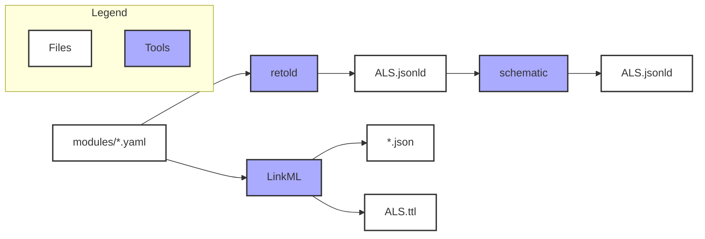
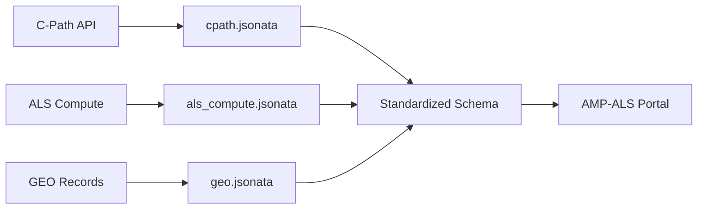

# ALS Data Model

A LinkML-based data model for the AMP-ALS Knowledge Portal, designed to harmonize and standardize metadata from multiple ALS research data sources.

## Table of Contents

- [Overview](#overview)
- [Quick Start](#quick-start)
- [Project Structure](#project-structure)
- [Data Model Architecture](#data-model-architecture)
- [Multi-Source Support](#multi-source-support)
- [Build Artifacts](#build-artifacts)
- [Data Mappings](#data-mappings)
- [Development](#development)
- [Contributing](#contributing)

## Overview

This repository contains a comprehensive data model for ALS (Amyotrophic Lateral Sclerosis) research data, built using the LinkML framework. The model supports:

- **Multi-source data integration** from various research platforms and databases
- **Standardized metadata schemas** for datasets, subjects, biospecimens, and assays
- **Flexible mapping system** to transform source-specific data into standardized formats
- **Multiple output formats** including JSON-LD, JSON Schema, YAML, and Turtle RDF

## Quick Start

### Prerequisites

- Conda/Miniconda installed
- Access to the `amp-als` conda environment (contains all required tools)

### Basic Usage

```bash
# Activate the environment
source ~/miniforge3/etc/profile.d/conda.sh
conda activate amp-als

# Build all artifacts
make all

# Build specific artifacts
make ALS.jsonld    # Main JSON-LD output
make ALS.yaml      # LinkML YAML format  
make Dataset       # JSON schema for Dataset entity
make ALS.ttl       # Turtle RDF format
```

## Project Structure

The project follows a hierarchical module organization that reflects the logical relationships between schemas:

```
├── modules/                           # Source schema definitions (hierarchical organization)
│   ├── portal/                        # 🎯 TOP LEVEL: Portal schemas for AMP-ALS
│   │   ├── Dataset.yaml              # Main dataset schema (inherits BaseDataset + mixins)
│   │   └── File.yaml                 # Main file schema
│   │
│   ├── base/                          # 🏗️ FOUNDATION: Abstract base classes
│   │   └── BaseDataset.yaml          # Abstract base for all dataset types
│   │
│   ├── mixins/                        # 🧩 COMPONENTS: Reusable attribute mixins
│   │   └── DatasetMixins.yaml        # ClinicalDatasetMixin + OmicDatasetMixin
│   │
│   ├── datasets/                      # 📊 DATASET TYPES: Domain-specific datasets
│   │   ├── ClinicalDataset.yaml      # Clinical dataset (BaseDataset + ClinicalMixin)
│   │   └── OmicDataset.yaml          # Omic dataset (BaseDataset + OmicMixin)
│   │
│   ├── entities/                      # 🗂️ CORE ENTITIES: Primary domain objects
│   │   ├── Subject.yaml              # Multi-source subject identification
│   │   ├── Biospecimen.yaml          # Biological specimen metadata
│   │   ├── ClinicalAssessment.yaml   # Clinical assessment data
│   │   └── AllDatasets.yaml          # Legacy combined datasets file
│   │
│   ├── clinical/                      # 🏥 CLINICAL DOMAIN: Clinical-specific modules
│   │   ├── assessments/              # Clinical assessment types
│   │   │   ├── dynamometry.yaml
│   │   │   ├── electrophysiology.yaml
│   │   │   ├── neurological.yaml
│   │   │   ├── psychiatric.yaml
│   │   │   └── vital-signs-physical.yaml
│   │   ├── data-management.yaml      # Clinical data management
│   │   ├── genetic-profile.yaml      # Genetic testing profiles
│   │   ├── laboratory.yaml           # Laboratory assessments
│   │   ├── medical-history.yaml      # Medical history data
│   │   ├── study-management.yaml     # Clinical study management
│   │   ├── treatments.yaml           # Treatment and medication data
│   │   └── visits.yaml               # Clinical visit schemas
│   │
│   ├── omics/                         # 🧬 OMICS DOMAIN: Omics-specific modules
│   │   ├── assays.yaml               # Measurement techniques and assays
│   │   ├── parameters.yaml           # Omics parameters and protocols
│   │   └── platforms.yaml            # Sequencing and analysis platforms
│   │
│   ├── reference/                     # 📚 REFERENCE DATA: Standard enums and types
│   │   ├── data-types.yaml           # Standard data type definitions
│   │   ├── file-formats.yaml         # File format specifications
│   │   ├── sex.yaml                  # Biological sex enumerations
│   │   └── species.yaml              # Species classifications
│   │
│   ├── governance/                    # ⚖️ GOVERNANCE: Policies and compliance
│   │   ├── licenses.yaml             # Data licensing terms
│   │   └── portals.yaml              # Data portal classifications
│   │
│   └── shared/                        # 🔧 SHARED UTILITIES: Common properties
│       ├── props.yaml                # Shared slot definitions (with portal subset)
│       └── common-enums.yaml         # Common enumeration values
│
├── mapping/                           # Data transformation mappings
│   ├── als_compute.jsonata           # ALS Compute transformations
│   ├── cpath.jsonata                 # Critical Path Institute mappings
│   ├── requirements.txt              # Python dependencies
│   └── transform_cpath.py            # Mapping execution script
├── json-schemas/                      # Generated JSON schemas for Synapse
├── dist/                              # Compiled artifacts (ALS.yaml, ALS.ttl, etc.)
├── header.yaml                       # Schema metadata and prefixes
├── Makefile                          # Build automation
└── README.md                         # This file
```

## Data Model Architecture

### Hierarchical Design Philosophy

The ALS data model uses a **hierarchical inheritance architecture** that promotes code reuse, maintainability, and semantic clarity:

```
🎯 portal/Dataset.yaml (Final Portal Schema)
├── inherits from: 🏗️ base/BaseDataset.yaml (Foundation)
├── uses mixins: 🧩 mixins/ClinicalDatasetMixin + OmicDatasetMixin (Components)
├── references: 🗂️ entities/* + 🏥 clinical/* + 🧬 omics/* (Domain Data)
└── builds with: 🔧 shared/* + 📚 reference/* + ⚖️ governance/* (Utilities)
```

#### Key Architectural Principles:

1. **Single Source of Truth**: `base/BaseDataset.yaml` defines common attributes once
2. **Composition over Duplication**: Mixins provide reusable attribute groups
3. **Clear Separation**: Each layer has a distinct responsibility
4. **Semantic Hierarchy**: Structure reflects logical relationships
5. **Extensibility**: Easy to add new dataset types or portal schemas

#### Inheritance Flow:

```yaml
# portal/Dataset.yaml (Top Level)
classes:
  Dataset:
    is_a: BaseDataset              # ← Inherits foundation attributes
    mixins: [ClinicalDatasetMixin, OmicDatasetMixin]  # ← Adds domain-specific features
    description: Union dataset for AMP-ALS portal
```

This approach eliminates code duplication while maintaining the flat JSON schema output required by downstream systems.

### Core Entities

#### Dataset
Represents research datasets with comprehensive metadata including:
- **Identification**: Title, description, creators, contributors
- **Content**: Species, measurement techniques, study types
- **Access**: Licensing, permissions, data use requirements
- **Provenance**: Source organization, publication info, citations

#### Subject
Individual participants or samples with multi-source identification:
- **Global Subject ID**: Unique identifier across all data sources (`{source}{dataset}{subject}`)
- **Original Subject ID**: Source-specific identifier for traceability
- **Dataset Reference**: Links subjects to their parent datasets
- **Data Source Prefix**: Indicates origin (cpath, als_compute, etc.)

#### Biospecimen (Planned)
Biological specimen information including:
- Tissue and organ types
- Specimen classification and processing details
- Collection and storage metadata

#### Assay (Extensible)
Experimental methodology details:
- Protocol specifications
- Instrument information
- Version tracking for reproducibility

### Module Organization Guide

#### 🎯 **portal/** - Final Portal Schemas
- **Purpose**: Consumer-facing schemas for the AMP-ALS portal
- **Content**: Main entry points that combine base classes with mixins
- **Usage**: Referenced in Makefile targets for JSON schema generation
- **Examples**: `Dataset.yaml` (main portal dataset), `File.yaml` (portal file)

#### 🏗️ **base/** - Foundation Layer  
- **Purpose**: Abstract base classes providing common attributes
- **Content**: Core class definitions marked as `abstract: true`
- **Inheritance**: Extended by dataset types using `is_a: BaseDataset`
- **Examples**: `BaseDataset.yaml` (common dataset attributes)

#### 🧩 **mixins/** - Reusable Components
- **Purpose**: Composable attribute groups for specific domains
- **Content**: Classes marked as `mixin: true` with focused attribute sets
- **Usage**: Combined in portal schemas using `mixins: [MixinName]`
- **Examples**: `ClinicalDatasetMixin`, `OmicDatasetMixin`

#### 📊 **datasets/** - Domain Dataset Types
- **Purpose**: Specific dataset implementations for different domains
- **Content**: Concrete classes that inherit from base + use mixins
- **Pattern**: `is_a: BaseDataset` + domain-specific attributes
- **Examples**: `ClinicalDataset.yaml`, `OmicDataset.yaml`

#### 🗂️ **entities/** - Core Domain Objects
- **Purpose**: Primary business entities and data structures
- **Content**: Subject, Biospecimen, Assessment schemas
- **Usage**: Referenced across multiple dataset types
- **Examples**: `Subject.yaml` (multi-source subjects), `Biospecimen.yaml`

#### 🏥 **clinical/** - Clinical Domain
- **Purpose**: Clinical research specific schemas and enumerations
- **Content**: Assessment types, medical procedures, study management
- **Organization**: Grouped by functional area (assessments/, treatments.yaml, etc.)

#### 🧬 **omics/** - Omics Domain  
- **Purpose**: Genomics, transcriptomics, and multi-omics schemas
- **Content**: Assays, platforms, protocols, processing levels
- **Usage**: Referenced by omic dataset types and mixins

#### 📚 **reference/** - Standard Reference Data
- **Purpose**: Standardized enumerations and data type definitions
- **Content**: Species, sex, file formats, data types
- **Scope**: Used across multiple domains and dataset types

#### ⚖️ **governance/** - Data Governance
- **Purpose**: Compliance, licensing, and data management policies  
- **Content**: License types, portal classifications, access controls
- **Usage**: Applied to datasets for compliance and access management

#### 🔧 **shared/** - Common Utilities
- **Purpose**: Shared properties and cross-cutting enumerations
- **Content**: `props.yaml` (portal subset slots), `common-enums.yaml`
- **Special**: `props.yaml` uses `in_subset: [portal]` for build filtering

### Benefits of This Organization

- **Clear Hierarchy**: Easy to understand relationships and dependencies
- **Semantic Clarity**: Folder names clearly indicate purpose and scope
- **Maintainability**: Changes propagate correctly through inheritance
- **Extensibility**: Simple to add new domains, mixins, or portal schemas  
- **Build Efficiency**: Makefile can precisely target required modules
- **Developer Experience**: Intuitive navigation and component discovery

## Multi-Source Support

### Supported Data Sources

| Source | Prefix | Description |
|--------|--------|-------------|
| `cpath` | Critical Path Institute | Clinical trial and regulatory data |
| `als_compute` | ALS Compute | Computational analysis datasets |
| `geo` | Gene Expression Omnibus | Genomics expression data |
| `sra` | Sequence Read Archive | Raw sequencing data |
| `target_als` | Target ALS | Therapeutic target data |
| `synapse` | Synapse | Sage Bionetworks platform |
| `all_als` | ALL ALS | Comprehensive ALS datasets |

### Global Identifier Strategy

Each subject receives a globally unique identifier following the pattern:
```
{data_source_prefix}:{dataset_id}:{original_subject_id}
```

Examples:
- `cpath:1725:SUBJ001` - Subject SUBJ001 from C-Path dataset 1725
- `als_compute:456:P789` - Subject P789 from ALS Compute dataset 456

This approach ensures:
- **Uniqueness** across all data sources
- **Traceability** back to original identifiers
- **Flexibility** to add new sources without conflicts

## Build Artifacts

The data model is compiled into multiple formats for different use cases:

| Artifact | Description | Use Case |
| -------- | ----------- | -------- |
| `ALS.jsonld` | Main output in schematic-compatible JSON-LD format | Distribution, schematic, Data Curator |
| `json-schemas/*.json` | JSON Schema serializations for entities | Synapse platform, validation |
| `dist/ALS.yaml` | Single LinkML-valid YAML file | LinkML tooling, development |
| `dist/ALS.ttl` | Turtle RDF format | Linked data applications, SPARQL queries |

### Build Process Flow



## Data Mappings

### Mapping Architecture

Data transformations are handled through JSONata expressions that map source-specific data structures to the standardized schema:



### Example Transformations

#### C-Path Dataset Mapping
```bash
python3 mapping/transform_cpath.py cpath_data.json mapping/cpath.jsonata -s json-schemas/Dataset.json
```

#### ALS Compute Subject Mapping (Future)
```bash
python3 mapping/transform_cpath.py als_compute_data.json mapping/als_compute.jsonata -s json-schemas/Subject.json
```

### Mapping Features

- **Source-specific logic** in separate JSONata files
- **Schema validation** against generated JSON schemas
- **Error handling** and logging for debugging
- **Flexible field mapping** with default values and transformations

## Development

### Environment Setup

```bash
# Clone the repository
git clone <repository-url>
cd data-model

# Activate the conda environment
source ~/miniforge3/etc/profile.d/conda.sh
conda activate amp-als

# Verify tools are available
which yq retold gen-json-schema
```

### Development Workflow

1. **Modify schemas** in `modules/` directory
2. **Update mappings** in `mapping/` for new data sources
3. **Test changes** with `make Dataset` or `make all`
4. **Validate output** with sample data transformations
5. **Update documentation** as needed

### Adding New Data Sources

1. **Add source to enum** in `modules/Sample/Subject.yaml`:
   ```yaml
   DataSourceEnum:
     permissible_values:
       new_source:
         description: Description of new data source
   ```

2. **Create mapping file** `mapping/new_source.jsonata`:
   ```json
   {
      "globalSubjectId": "new_source" & dataset_id & subject_id,
     "originalSubjectId": subject_id,
     "datasetReference": dataset_id,
     "dataSourcePrefix": "new_source"
   }
   ```

3. **Test transformation**:
   ```bash
   python3 mapping/transform_cpath.py sample_data.json mapping/new_source.jsonata -s json-schemas/Subject.json
   ```

### Code Style Guidelines

- **YAML**: 2-space indentation, include description fields
- **JSONata**: Use comments for future fields, consistent naming
- **File naming**: snake_case for scripts, PascalCase for YAML classes
- **Documentation**: Update README and inline docs for schema changes

## Contributing

### Making Changes

1. **Create feature branch** from main
2. **Implement changes** following development guidelines
3. **Test thoroughly** with `make all` and sample data
4. **Update documentation** including this README
5. **Submit pull request** with clear description

### CI/CD

The repository includes automated testing that:
- Validates schema syntax with LinkML
- Builds all artifacts successfully
- Runs schematic validation on output
- Checks for breaking changes

## Additional Resources

- **LinkML Documentation**: https://linkml.io/
- **JSONata Language**: https://jsonata.org/
- **Schematic Framework**: https://github.com/Sage-Bionetworks/schematic
- **AMP-ALS Portal**: https://www.synapse.org/#!Synapse:syn2580853

For questions or support, please contact the maintainers or create an issue in this repository.