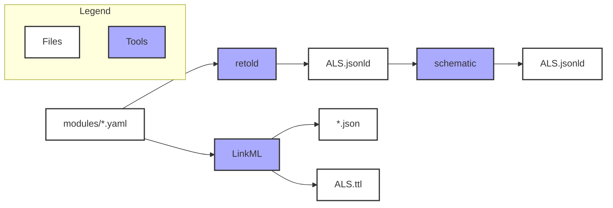
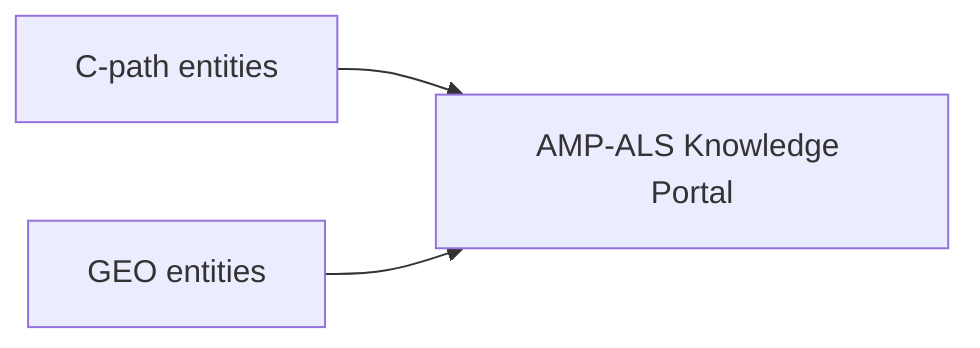

## Data Model

### Artifacts 

The data model is compiled and released as several different artifacts using various tooling. 
We keep the main one, `ALS.jsonld`, in the root of the repository, while others are available in `json-schemas` and `dist` folders.

#### A nice table summarizing what you might want to grab for different purposes

| Artifact | Description |
| -------- | ----------- |
| `ALS.jsonld` | Main output in schematic-compatible JSON-LD format, for distribution and use with schematic and Data Curator. |
| `json-schemas/*.json` | JSON serializations for main entities data model, for native functionality with Synapse platform or wherever a JSON schema is preferred. |
| `dist/ALS.yaml` | Data model as as a single LinkML-valid YAML file, useful for using LinkML tooling. |
| `dist/ALS.ttl` | ALS model in Turtle linked data format. |

In general, .jsonld or .ttl artifacts are best for model querying and comparison if you know how to load them into compatible linked data tooling. 

The model may also be browseable with a UI in a platform called CoreModels. Please see maintainers for this route.

#### Details about the source/processing if you need to do more than just download an artifact

- `modules/*.yaml`: Source files. Refer to [Data Model Framework](#data-model-framework) for editing guidelines.
- `Makefile`: Scripts to build the artifacts from the source files.

## Mappings

Mappings for entities are defined in the `mappings` directory. 

Example transform with validation:

- (C-path) `python3 transform_cpath.py path/to/input.json cpath.jsonata -s ../json-schemas/Dataset.json`