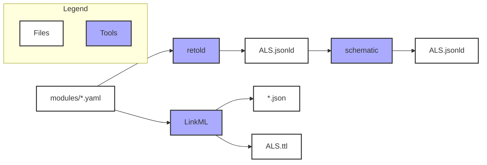
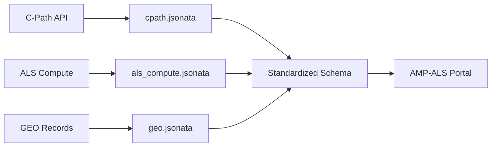

# ALS Data Model

A LinkML-based data model for the AMP-ALS Knowledge Portal, designed to harmonize and standardize metadata from multiple ALS research data sources.

## Table of Contents

- [Overview](#overview)
- [Quick Start](#quick-start)
- [Project Structure](#project-structure)
- [Data Model Architecture](#data-model-architecture)
- [Multi-Source Support](#multi-source-support)
- [Build Artifacts](#build-artifacts)
- [Data Mappings](#data-mappings)
- [Development](#development)
- [Contributing](#contributing)

## Overview

This repository contains a comprehensive data model for ALS (Amyotrophic Lateral Sclerosis) research data, built using the LinkML framework. The model supports:

- **Multi-source data integration** from various research platforms and databases
- **Standardized metadata schemas** for datasets, subjects, biospecimens, and assays
- **Flexible mapping system** to transform source-specific data into standardized formats
- **Multiple output formats** including JSON-LD, JSON Schema, YAML, and Turtle RDF

## Quick Start

### Prerequisites

- Conda/Miniconda installed
- Access to the `amp-als` conda environment (contains all required tools)

### Basic Usage

```bash
# Activate the environment
source ~/miniforge3/etc/profile.d/conda.sh
conda activate amp-als

# Build all artifacts
make all

# Build specific artifacts
make ALS.jsonld    # Main JSON-LD output
make ALS.yaml      # LinkML YAML format  
make Dataset       # JSON schema for Dataset entity
make ALS.ttl       # Turtle RDF format
```

## Project Structure

```
├── modules/                    # Source schema definitions
│   ├── base/                   # Base dataset/file templates
│   │   ├── BaseDataset.yaml
│   │   └── BaseFile.yaml
│   ├── clinical/               # Clinical domain schemas
│   │   ├── assessments/        # Assessment schemas
│   │   └── *.yaml
│   ├── datasets/               # Dataset/file specializations
│   │   ├── ClinicalDataset.yaml
│   │   ├── ClinicalFile.yaml
│   │   ├── OmicDataset.yaml
│   │   └── OmicFile.yaml
│   ├── entities/               # Core entities
│   │   ├── Subject.yaml
│   │   ├── Biospecimen.yaml
│   │   ├── ClinicalAssessment.yaml
│   │   └── AllDatasets.yaml
│   ├── governance/             # Licensing and portal vocab
│   │   ├── licenses.yaml
│   │   └── portals.yaml
│   ├── mixins/                 # Reusable mixins
│   │   ├── DatasetMixins.yaml
│   │   └── FileMixins.yaml
│   ├── omics/                  # Omics vocab and enums
│   │   ├── assays.yaml
│   │   ├── parameters.yaml
│   │   └── platforms.yaml
│   ├── portal/                 # Portal-facing schemas
│   │   ├── Dataset.yaml
│   │   └── File.yaml
│   ├── reference/              # Reference vocabularies
│   │   ├── data-types.yaml
│   │   ├── file-formats.yaml
│   │   ├── sex.yaml
│   │   └── species.yaml
│   └── shared/                 # Shared slots and enums
│       ├── props.yaml
│       ├── common-enums.yaml
│       ├── annotations.yaml
│       └── analysis-methods.yaml
├── mapping/                   # Data transformation mappings
│   ├── als_compute.jsonata    # ALS Compute transformations
│   ├── cpath.jsonata          # Critical Path Institute mappings
│   ├── requirements.txt       # Python dependencies
│   └── transform_cpath.py     # Mapping execution script
├── json-schemas/              # Generated JSON schemas
├── dist/                      # Compiled artifacts
├── header.yaml               # Schema metadata
├── Makefile                  # Build automation
└── README.md                 # This file
```

## Data Model Architecture

### Core Entities

#### Dataset
Represents research datasets with comprehensive metadata including:
- **Identification**: Title, description, creators, contributors
- **Content**: Species, measurement techniques, study types
- **Access**: Licensing, permissions, data use requirements
- **Provenance**: Source organization, publication info, citations

#### Subject
Individual participants or samples with multi-source identification:
- **Global Subject ID**: Unique identifier across all data sources (`{source}{dataset}{subject}`)
- **Original Subject ID**: Source-specific identifier for traceability
- **Dataset Reference**: Links subjects to their parent datasets
- **Data Source Prefix**: Indicates origin (cpath, als_compute, etc.)

#### Biospecimen (Planned)
Biological specimen information including:
- Tissue and organ types
- Specimen classification and processing details
- Collection and storage metadata

#### Assay (Extensible)
Experimental methodology details:
- Protocol specifications
- Instrument information
- Version tracking for reproducibility

### Schema Organization

The modular design allows for:
- **Separation of concerns** with focused schema files
- **Reusable components** through shared properties
- **Easy extension** by adding new modules
- **Version control** friendly structure

## Multi-Source Support

### Supported Data Sources

| Source | Prefix | Description |
|--------|--------|-------------|
| `cpath` | Critical Path Institute | Clinical trial and regulatory data |
| `als_compute` | ALS Compute | Computational analysis datasets |
| `geo` | Gene Expression Omnibus | Genomics expression data |
| `sra` | Sequence Read Archive | Raw sequencing data |
| `target_als` | Target ALS | Therapeutic target data |
| `synapse` | Synapse | Sage Bionetworks platform |
| `all_als` | ALL ALS | Comprehensive ALS datasets |

### Global Identifier Strategy

Each subject receives a globally unique identifier following the pattern:
```
{data_source_prefix}:{dataset_id}:{original_subject_id}
```

Examples:
- `cpath:1725:SUBJ001` - Subject SUBJ001 from C-Path dataset 1725
- `als_compute:456:P789` - Subject P789 from ALS Compute dataset 456

This approach ensures:
- **Uniqueness** across all data sources
- **Traceability** back to original identifiers
- **Flexibility** to add new sources without conflicts

## Build Artifacts

The data model is compiled into multiple formats for different use cases:

| Artifact | Description | Use Case |
| -------- | ----------- | -------- |
| `ALS.jsonld` | Main output in schematic-compatible JSON-LD format | Distribution, schematic, Data Curator |
| `json-schemas/*.json` | JSON Schema serializations for entities | Synapse platform, validation |
| `dist/ALS.yaml` | Single LinkML-valid YAML file | LinkML tooling, development |
| `dist/ALS.ttl` | Turtle RDF format | Linked data applications, SPARQL queries |

### Build Process Flow



## Data Mappings

### Mapping Architecture

Data transformations are handled through JSONata expressions that map source-specific data structures to the standardized schema:



### Example Transformations

#### C-Path Dataset Mapping
```bash
python3 mapping/transform_cpath.py cpath_data.json mapping/cpath.jsonata -s json-schemas/Dataset.json
```

#### ALS Compute Subject Mapping (Future)
```bash
python3 mapping/transform_cpath.py als_compute_data.json mapping/als_compute.jsonata -s json-schemas/Subject.json
```

### Mapping Features

- **Source-specific logic** in separate JSONata files
- **Schema validation** against generated JSON schemas
- **Error handling** and logging for debugging
- **Flexible field mapping** with default values and transformations

## Development

### Environment Setup

```bash
# Clone the repository
git clone <repository-url>
cd data-model

# Activate the conda environment
source ~/miniforge3/etc/profile.d/conda.sh
conda activate amp-als

# Verify tools are available
which yq retold gen-json-schema
```

### Development Workflow

1. **Modify schemas** in `modules/` directory
2. **Update mappings** in `mapping/` for new data sources
3. **Test changes** with `make Dataset` or `make all`
4. **Validate output** with sample data transformations
5. **Update documentation** as needed

### Adding New Data Sources

1. **Add source to enum** in `modules/entities/Subject.yaml`:
   ```yaml
   DataSourceEnum:
     permissible_values:
       new_source:
         description: Description of new data source
   ```

2. **Create mapping file** `mapping/new_source.jsonata`:
   ```json
   {
      "globalSubjectId": "new_source" & dataset_id & subject_id,
     "originalSubjectId": subject_id,
     "datasetReference": dataset_id,
     "dataSourcePrefix": "new_source"
   }
   ```

3. **Test transformation**:
   ```bash
   python3 mapping/transform_cpath.py sample_data.json mapping/new_source.jsonata -s json-schemas/Subject.json
   ```

### Code Style Guidelines

- **YAML**: 2-space indentation, include description fields
- **JSONata**: Use comments for future fields, consistent naming
- **File naming**: snake_case for scripts, PascalCase for YAML classes
- **Documentation**: Update README and inline docs for schema changes

## Contributing

### Making Changes

1. **Create feature branch** from main
2. **Implement changes** following development guidelines
3. **Test thoroughly** with `make all` and sample data
4. **Update documentation** including this README
5. **Submit pull request** with clear description

### CI/CD

The repository includes automated testing that:
- Validates schema syntax with LinkML
- Builds all artifacts successfully
- Runs schematic validation on output
- Checks for breaking changes

## Additional Resources

- **LinkML Documentation**: https://linkml.io/
- **JSONata Language**: https://jsonata.org/
- **Schematic Framework**: https://github.com/Sage-Bionetworks/schematic
- **AMP-ALS Portal**: https://www.synapse.org/#!Synapse:syn2580853

For questions or support, please contact the maintainers or create an issue in this repository.
