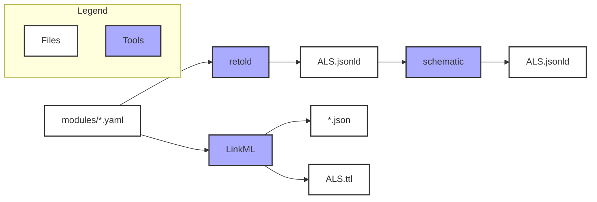
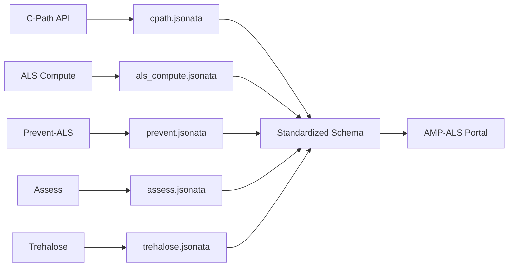

# ALS Data Model

A LinkML-based data model for the AMP-ALS Knowledge Portal, designed to harmonize and standardize metadata from multiple ALS research data sources.

## Table of Contents

- [Overview](#overview)
- [Quick Start](#quick-start)
- [Project Structure](#project-structure)
- [Data Model Architecture](#data-model-architecture)
- [Multi-Source Support](#multi-source-support)
- [Build Artifacts](#build-artifacts)
- [Data Mappings](#data-mappings)
- [Development](#development)
- [Repository Hygiene](#repository-hygiene)
- [Contributing](#contributing)

## Overview

This repository contains a comprehensive data model for ALS (Amyotrophic Lateral Sclerosis) research data, built using the LinkML framework. The model supports:

- **Multi-source data integration** from various research platforms and databases
- **Standardized metadata schemas** for datasets, subjects, biospecimens, and assays
- **Flexible mapping system** to transform source-specific data into standardized formats
- **Multiple output formats** including JSON-LD, JSON Schema, YAML, and Turtle RDF

## Quick Start

### Prerequisites

- Conda/Miniconda installed
- Access to the `amp-als` conda environment (contains all required tools)

### Basic Usage

```bash
# Activate the environment
source ~/miniforge3/etc/profile.d/conda.sh
conda activate amp-als

# Build all artifacts (ALS.jsonld, dist/ALS.yaml, ALS.ttl, dist/ALS.toon)
make all

# Build specific artifacts
make ALS.jsonld        # Main JSON-LD output
make dist/ALS.yaml     # LinkML YAML format
make ALS.ttl           # Turtle RDF format
make linkml_jsonld     # LinkML JSON-LD output

# Build JSON schemas
make Dataset
make ClinicalDataset
make OmicDataset
make File
make ClinicalFile
make OmicFile
make SpeechDataset
make SpeechFile

# Force rebuild
make -B
```

## Project Structure

The project follows a hierarchical module organization that reflects the logical relationships between schemas:

```
├── modules/                           # Source schema definitions (hierarchical organization)
│   ├── portal/                        # 🎯 TOP LEVEL: Portal schemas for AMP-ALS
│   │   ├── Dataset.yaml              # Portal dataset schema
│   │   └── File.yaml                 # Portal file schema
│   │
│   ├── base/                          # 🏗️ FOUNDATION: Abstract base classes
│   │   ├── BaseDataset.yaml          # Abstract base for all dataset types
│   │   └── BaseFile.yaml             # Abstract base for all file types
│   │
│   ├── mixins/                        # 🧩 COMPONENTS: Reusable attribute mixins
│   │   ├── CommonMixins.yaml         # Cross-cutting mixins (DiseaseMixin, CommonMetadataMixin, SubjectDemographicsMixin, etc.)
│   │   ├── DatasetMixins.yaml        # Clinical + omic dataset mixins (reference slots from props.yaml)
│   │   └── FileMixins.yaml           # Clinical + omic file mixins (reference slots from props.yaml)
│   │
│   ├── datasets/                      # 📊 DATASET TYPES: Domain-specific datasets/files
│   │   ├── ClinicalDataset.yaml
│   │   ├── OmicDataset.yaml
│   │   ├── SpeechDataset.yaml        # Speech assessment dataset (SDTM FT domain)
│   │   ├── ClinicalFile.yaml
│   │   ├── OmicFile.yaml             # Omic file schema (site_of_onset, referenceGenome, variantType)
│   │   └── SpeechFile.yaml           # Speech file/folder schema (subject, session, and archive levels)
│   │
│   ├── entities/                      # 🗂️ CORE ENTITIES: Primary domain objects
│   │   ├── Subject.yaml              # Multi-source subject identification
│   │   ├── Biospecimen.yaml          # Biological specimen metadata
│   │   └── ClinicalAssessment.yaml   # Clinical assessment data
│   │
│   ├── clinical/                      # 🏥 CLINICAL DOMAIN: Clinical-specific modules
│   │   ├── assessments/              # Clinical assessment types
│   │   │   ├── assess_generated.yaml          # Auto-generated ASSESS study assessments
│   │   │   ├── demographics.yaml              # Demographic assessments
│   │   │   ├── dynamometry.yaml
│   │   │   ├── electrophysiology.yaml
│   │   │   ├── neurological.yaml
│   │   │   ├── other_generated_assessments.yaml  # Other auto-generated assessments
│   │   │   ├── psychiatric.yaml
│   │   │   ├── speech.yaml
│   │   │   ├── symptoms.yaml                  # Patient-reported symptoms (renamed from symptom-questionnaire.yaml)
│   │   │   └── vital-signs-physical.yaml
│   │   ├── data-management.yaml
│   │   ├── data-types.yaml
│   │   ├── domains.yaml
│   │   ├── genetic-profile.yaml               # Genetic testing, family history (FamilyHistorySubtypeEnum)
│   │   ├── laboratory.yaml
│   │   ├── medical-history.yaml
│   │   ├── phenoconversion.yaml               # Phenoconversion tracking (site_of_onset via SiteOfOnsetEnum)
│   │   ├── study-management.yaml
│   │   ├── treatments.yaml
│   │   └── visits.yaml
│   │
│   ├── omics/                         # 🧬 OMICS DOMAIN: Omics-specific modules
│   │   ├── assays.yaml
│   │   ├── data-types.yaml           # OmicDataTypeEnum (md5, index added)
│   │   ├── parameters.yaml           # AlignmentMethodEnum, LibraryPreparationMethodEnum, VariantTypeEnum, GenomicReferenceEnum
│   │   └── platforms.yaml
│   │
│   ├── reference/                     # 📚 REFERENCE DATA: Standard enums and types
│   │   ├── data-types.yaml
│   │   ├── file-formats.yaml
│   │   ├── sex.yaml
│   │   └── species.yaml
│   │
│   ├── governance/                    # ⚖️ GOVERNANCE: Policies and compliance
│   │   ├── licenses.yaml
│   │   └── portals.yaml
│   │
│   └── shared/                        # 🔧 SHARED UTILITIES: Common properties
│       ├── analysis-methods.yaml      # AnalysisMethodEnum
│       ├── annotations.yaml
│       ├── common-enums.yaml          # DiseaseEnum, DiseaseSubtypeEnum, CurationLevelEnum, LibraryLayoutEnum, and more
│       ├── metadata-schema-template.yaml
│       └── props.yaml                 # Canonical shared slots (in_subset: [portal]); all reusable cross-class fields live here
│
├── mapping/                           # Data transformation mappings
│   ├── *.jsonata                      # Source-to-schema mappings
│   ├── transform_*.py                 # Mapping execution scripts
│   └── view_to_class_mapping.md       # Reference mapping notes
├── json-schemas/                      # Generated JSON schemas for Synapse
├── dist/                              # Compiled artifacts (ALS.yaml, ALS.ttl, ALS.toon, etc.)
├── scripts/                           # Utility scripts (setup, model management, schematic)
├── manifests/                         # Manifest staging (empty by default)
├── notebooks/                         # Exploratory notebooks (local use)
├── data/                              # Local data (ignored)
├── metadata/                          # Local metadata (ignored)
├── retold/                            # Retold tool checkout (local use)
├── node_modules/                      # Node dependencies (local use)
├── header.yaml                        # Schema metadata and prefixes
├── Makefile                           # Build automation
└── README.md                          # This file
```

## Data Model Architecture

### Hierarchical Design Philosophy

The ALS data model uses a **hierarchical inheritance architecture** that promotes code reuse, maintainability, and semantic clarity:

```
🎯 portal/Dataset.yaml (Final Portal Schema)
├── inherits from: 🏗️ base/BaseDataset.yaml (Foundation)
├── uses mixins: 🧩 mixins/ClinicalDatasetMixin + OmicDatasetMixin (Components)
├── references: 🗂️ entities/* + 🏥 clinical/* + 🧬 omics/* (Domain Data)
└── builds with: 🔧 shared/* + 📚 reference/* + ⚖️ governance/* (Utilities)
```

#### Key Architectural Principles:

1. **Define everything exactly once**: Every field, enum, and class has a single canonical location. Search before adding.
2. **Shared slots live in `props.yaml`**: Reusable cross-class fields are defined as `slots:` with `in_subset: [portal]` in `modules/shared/props.yaml`. Classes and mixins reference them via `slots:` lists, never by redefining inline.
3. **Composition over Duplication**: Mixins provide reusable attribute groups; domain-specific overrides use `slot_usage:` rather than re-declaring inline.
4. **Clear Separation**: Each layer has a distinct responsibility — slots define the field, mixins group related fields, classes apply them to a domain.
5. **Semantic Hierarchy**: Structure reflects logical relationships.
6. **Extensibility**: Easy to add new dataset types or portal schemas.

#### Inheritance Flow:

```yaml
# portal/Dataset.yaml (Top Level)
classes:
  Dataset:
    is_a: BaseDataset              # ← Inherits foundation attributes
    mixins: [ClinicalDatasetMixin, OmicDatasetMixin]  # ← Adds domain-specific features
    description: Union dataset for AMP-ALS portal
```

This approach eliminates code duplication while maintaining the flat JSON schema output required by downstream systems.

The same pattern applies to files:

```yaml
# portal/File.yaml (Top Level)
classes:
  File:
    is_a: BaseFile                 # ← Inherits foundation attributes
    mixins: [ClinicalFileMixin, OmicFileMixin]  # ← Adds domain-specific features
    description: Union file for AMP-ALS portal
```

### Core Entities

#### Dataset
Represents research datasets with comprehensive metadata including:
- **Identification**: Title, description, creators, contributors
- **Content**: Species, measurement techniques, study types
- **Access**: Licensing, permissions, data use requirements
- **Provenance**: Source organization, publication info, citations

#### Subject
Individual participants or samples with multi-source identification:
- **Global Subject ID**: Unique identifier across all data sources (`{source}{dataset}{subject}`)
- **Original Subject ID**: Source-specific identifier for traceability
- **Dataset Reference**: Links subjects to their parent datasets
- **Data Source Prefix**: Indicates origin (cpath, als_compute, etc.)

#### Biospecimen (Planned)
Biological specimen information including:
- Tissue and organ types
- Specimen classification and processing details
- Collection and storage metadata

#### Assay (Extensible)
Experimental methodology details:
- Protocol specifications
- Instrument information
- Version tracking for reproducibility

### Module Organization Guide

#### 🎯 **portal/** - Final Portal Schemas
- **Purpose**: Consumer-facing schemas for the AMP-ALS portal
- **Content**: Main entry points that combine base classes with mixins
- **Usage**: Referenced in Makefile targets for JSON schema generation
- **Examples**: `Dataset.yaml` (main portal dataset), `File.yaml` (portal file)

#### 🏗️ **base/** - Foundation Layer  
- **Purpose**: Abstract base classes providing common attributes
- **Content**: Core class definitions marked as `abstract: true`
- **Inheritance**: Extended by dataset types using `is_a: BaseDataset`
- **Examples**: `BaseDataset.yaml` (common dataset attributes)

#### 🧩 **mixins/** - Reusable Components
- **Purpose**: Composable attribute groups for specific domains
- **Content**: Classes marked as `mixin: true`. Most fields are referenced via `slots:` pointing to `props.yaml`; only truly local one-off fields stay as inline `attributes:`.
- **Usage**: Combined in portal schemas using `mixins: [MixinName]`
- **Examples**: `ClinicalDatasetMixin`, `OmicDatasetMixin`, `OmicFileMixin`, `CommonMetadataMixin`

#### 📊 **datasets/** - Domain Dataset Types
- **Purpose**: Specific dataset implementations for different domains
- **Content**: Concrete classes that inherit from base + use mixins
- **Pattern**: `is_a: BaseDataset` + domain-specific attributes
- **Examples**: `ClinicalDataset.yaml`, `OmicDataset.yaml`

#### 🗂️ **entities/** - Core Domain Objects
- **Purpose**: Primary business entities and data structures
- **Content**: Subject, Biospecimen, Assessment schemas
- **Usage**: Referenced across multiple dataset types
- **Examples**: `Subject.yaml` (multi-source subjects), `Biospecimen.yaml`

#### 🏥 **clinical/** - Clinical Domain
- **Purpose**: Clinical research specific schemas and enumerations
- **Content**: Assessment types, medical procedures, study management
- **Organization**: Grouped by functional area (assessments/, treatments.yaml, etc.)

#### 🧬 **omics/** - Omics Domain  
- **Purpose**: Genomics, transcriptomics, and multi-omics schemas
- **Content**: Assays, platforms, protocols, processing levels
- **Usage**: Referenced by omic dataset types and mixins

#### 📚 **reference/** - Standard Reference Data
- **Purpose**: Standardized enumerations and data type definitions
- **Content**: Species, sex, file formats, data types
- **Scope**: Used across multiple domains and dataset types

#### ⚖️ **governance/** - Data Governance
- **Purpose**: Compliance, licensing, and data management policies  
- **Content**: License types, portal classifications, access controls
- **Usage**: Applied to datasets for compliance and access management

#### 🔧 **shared/** - Common Utilities
- **Purpose**: Shared properties and cross-cutting enumerations
- **Content**: `props.yaml` (canonical portal slots), `common-enums.yaml` (shared enums used across domains)
- **Special**: `props.yaml` is the single source of truth for all reusable cross-class fields. Only slots marked `in_subset: [portal]` are included in per-schema builds via `relevant_props.yaml`. Every field that appears in more than one class or mixin must be defined here — never duplicated inline.

### Benefits of This Organization

- **Clear Hierarchy**: Easy to understand relationships and dependencies
- **Semantic Clarity**: Folder names clearly indicate purpose and scope
- **Maintainability**: Changes propagate correctly through inheritance
- **Extensibility**: Simple to add new domains, mixins, or portal schemas  
- **Build Efficiency**: Makefile can precisely target required modules
- **Developer Experience**: Intuitive navigation and component discovery

## Multi-Source Support

### Supported Data Sources

| Source | Prefix | Description |
|--------|--------|-------------|
| `cpath` | Critical Path Institute | Clinical trial and regulatory data |
| `als_compute` | ALS Compute | Computational analysis datasets |
| `geo` | Gene Expression Omnibus | Genomics expression data |
| `sra` | Sequence Read Archive | Raw sequencing data |
| `target_als` | Target ALS | Therapeutic target data |
| `synapse` | Synapse | Sage Bionetworks platform |
| `all_als` | ALL ALS | Comprehensive ALS datasets |

### Global Identifier Strategy

Each subject receives a globally unique identifier following the pattern:
```
{data_source_prefix}{dataset_id}{original_subject_id}
```

Examples:
- `cpath_1725_SUBJ001` - Subject SUBJ001 from C-Path dataset 1725
- `als_compute_456_P789` - Subject P789 from ALS Compute dataset 456

This approach ensures:
- **Uniqueness** across all data sources
- **Traceability** back to original identifiers
- **Flexibility** to add new sources without conflicts

## Build Artifacts

The data model is compiled into multiple formats for different use cases:

| Artifact | Description | Use Case |
| -------- | ----------- | -------- |
| `ALS.jsonld` | Main output in schematic-compatible JSON-LD format | Distribution, schematic, Data Curator |
| `json-schemas/*.json` | JSON Schema serializations for entities | Synapse platform, validation |
| `dist/ALS.yaml` | Single LinkML-valid YAML file | LinkML tooling, development |
| `dist/ALS.ttl` | Turtle RDF format | Linked data applications, SPARQL queries |
| `dist/ALS.toon` | Toon-formatted JSON output | Schema diffs, reviews |
| `dist/ALS_linkml.jsonld` | LinkML JSON-LD output | LinkML tooling |

### Build Process Flow


```mermaid
graph LR
    A[modules/*.yaml] --> B[retold]
    B --> C[ALS.jsonld]
    C --> D[schematic]
    D --> E[ALS.jsonld]
    A --> L[LinkML]
    L --> J[*.json]
    L --> T[ALS.ttl]

class B,D tools
    
    %% Legend
    subgraph Legend
        G[Files]
        H[Tools]
    end

style A fill:white,stroke:#333,stroke-width:2px;
style C fill:white,stroke:#333,stroke-width:2px;
style E fill:white,stroke:#333,stroke-width:2px;
style G fill:white,stroke:#333,stroke-width:2px;
style J fill:white,stroke:#333,stroke-width:2px;
style T fill:white,stroke:#333,stroke-width:2px;
style B fill:#aaf,stroke:#333,stroke-width:2px
style D fill:#aaf,stroke:#333,stroke-width:2px
style H fill:#aaf,stroke:#333,stroke-width:2px
style L fill:#aaf,stroke:#333,stroke-width:2px
```

## Data Mappings

### Mapping Architecture

Data transformations are handled through JSONata expressions that map source-specific data structures to the standardized schema:


```mermaid
graph LR
    CPATH["C-Path API"] --> CMAP["cpath.jsonata"]
    ALSCOMP["ALS Compute"] --> AMAP["als_compute.jsonata"]
    PREVENT["Prevent-ALS"] --> PMAP["prevent.jsonata"]
    ASSESS["Assess"] --> ASMAP["assess.jsonata"]
    TREHALOSE["Trehalose"] --> TMAP["trehalose.jsonata"]
    
    CMAP --> SCHEMA["Standardized Schema"]
    AMAP --> SCHEMA
    PMAP --> SCHEMA
    ASMAP --> SCHEMA
    TMAP --> SCHEMA
    
    SCHEMA --> PORTAL["AMP-ALS Portal"]
```

### Example Transformations

#### C-Path Dataset Mapping
```bash
python3 mapping/transform_cpath.py cpath_data.json mapping/cpath.jsonata -s json-schemas/Dataset.json
```

#### ALS Compute Dataset Mapping
```bash
python3 mapping/transform_cpath.py als_compute_data.json mapping/als_compute.jsonata -s json-schemas/Dataset.json
```

#### Prevent-ALS Dataset Mapping
```bash
python3 mapping/transform_prevent.py prevent_data.json mapping/prevent.jsonata -s json-schemas/Dataset.json
```

#### Assess Mapping
```bash
python3 mapping/transform_assess.py assess_data.json mapping/assess.jsonata -s json-schemas/ClinicalAssessment.json
```

#### Trehalose Mapping
```bash
python3 mapping/transform_trehalose.py trehalose_data.json mapping/trehalose.jsonata -s json-schemas/Dataset.json
```

### Mapping Features

- **Source-specific logic** in separate JSONata files
- **Schema validation** against generated JSON schemas
- **Error handling** and logging for debugging
- **Flexible field mapping** with default values and transformations

## Development

### Environment Setup

```bash
# Clone the repository
git clone <repository-url>
cd data-model_refactor

# Activate the conda environment
source ~/miniforge3/etc/profile.d/conda.sh
conda activate amp-als

# Verify tools are available
which yq retold gen-json-schema json-dereference jq
```

### Build and Test Commands

```bash
# Build artifacts
make all
make ALS.jsonld
make dist/ALS.yaml
make ALS.ttl
make linkml_jsonld
make Dataset
make ClinicalDataset
make OmicDataset
make File
make ClinicalFile
make OmicFile
make SpeechDataset
make SpeechFile
make -B

# Validate schema format
schematic schema convert ALS.jsonld

# Run tests (if added)
pytest
pytest mapping/test_*.py
pytest -k "test_name"
```

### Mapping Validation

```bash
python3 mapping/transform_cpath.py input.json mapping/cpath.jsonata -s json-schemas/Dataset.json
python3 mapping/transform_cpath.py input.json mapping/cpath.jsonata --strict --log-errors errors.json
```

### Development Workflow

1. **Modify schemas** in `modules/` directory
2. **Update mappings** in `mapping/` for new data sources
3. **Test changes** with `make Dataset` or `make all`
4. **Validate output** with sample data transformations
5. **Update documentation** as needed

### Adding New Data Sources

1. **Add source to enum** in `modules/entities/Subject.yaml`:
   ```yaml
   DataSourceEnum:
     permissible_values:
       new_source:
         description: Description of new data source
   ```

2. **Create mapping file** `mapping/new_source.jsonata`:
   ```json
   {
      "globalSubjectId": "new_source" & dataset_id & subject_id,
     "originalSubjectId": subject_id,
     "datasetReference": dataset_id,
     "dataSourcePrefix": "new_source"
   }
   ```

3. **Test transformation**:
   ```bash
   python3 mapping/transform_cpath.py sample_data.json mapping/new_source.jsonata -s json-schemas/Dataset.json
   ```

### Code Style Guidelines

- **YAML**: 2-space indentation, follow LinkML schema conventions, include description fields
- **Python**: PEP 8, use type hints, handle exceptions with try/except, import JSONata as `from jsonata import jsonata`
- **JSONata**: Store expressions in `.jsonata` files, use conditional logic for optional fields
- **File naming**: snake_case for scripts, PascalCase for YAML classes
- **Imports**: Group standard library, third-party, then local modules with blank lines
- **Documentation**: Update README and inline docs for schema changes

## Repository Hygiene

### Generated and Temporary Files

These are created by `make` targets or local tooling and can be deleted safely:

- `ALS.jsonld`
- `dist/`
- `json-schemas/`
- `merged*.yaml`
- `relevant_props.yaml`
- `relevant_enums.yaml`
- `temp.yaml`
- `tmp.json`

If you want to clean these manually:

```bash
rm -rf ALS.jsonld dist json-schemas merged*.yaml relevant_props.yaml relevant_enums.yaml temp.yaml tmp.json
```

### Local-Only and Sensitive Files

Keep these out of version control and store credentials outside the repo:

- `client_secret.json`
- `schematic_service_account_creds.json`

## Contributing

### Making Changes

1. **Create feature branch** from main
2. **Implement changes** following development guidelines
3. **Test thoroughly** with `make all` and sample data
4. **Update documentation** including this README
5. **Submit pull request** with clear description

### CI/CD

The repository includes automated testing that:
- Validates schema syntax with LinkML
- Builds all artifacts successfully
- Runs schematic validation on output
- Checks for breaking changes

## Recent Schema Changes

For a full chronological change log, see [`docs/DATA_MODEL_CHANGES_JULY_2026.md`](docs/DATA_MODEL_CHANGES_JULY_2026.md).

### July 2026 — Slot Deduplication & DRY Cleanup

The primary focus of this work was eliminating duplicate field definitions and enforcing the rule that every reusable field is defined exactly once in `props.yaml`.

**`modules/shared/props.yaml`**
- Promoted to the canonical source of truth for all cross-class fields
- Added `in_subset: [portal]` and corrected `multivalued`/`required` for 15 existing slots that were previously dead code (`assay`, `fileFormat`, `libraryLayout`, `libraryPreparationMethod`, `assessmentType`, `clinicalDomain`, `administrationMode`, `studyPhase`, `keyMeasures`, `hasLongitudinalData`, `completenessLevel`, `contributor`, `species`, `citation`, `creator`)
- Added 8 new slots promoted from inline duplicates: `platform`, `keywords`, `curationLevel`, `studyType`, `GEOSuperSeries`, `FACSPopulation`, `participant_count`, `alignmentMethod`
- Fixed `funder` slot: `range: string` → `range: FunderEnum`, added `multivalued: true`
- Fixed `dataType` slot: added `multivalued: true`, `required: false`

**`modules/mixins/` and `modules/base/`**
- Removed all inline `attributes:` definitions for fields that are now canonical slots in `props.yaml`
- `CommonMetadataMixin`: `description`, `creator`, `contributor`, `species`, `citation` → `slots:` references
- `BaseDataset`: `title`, `keywords`, `curationLevel`, `studyType`, `participant_count` → `slots:` references; introduced `slot_usage: keywords: required: true` for dataset-level override
- `BaseFile`: `keywords`, `curationLevel` → `slots:` references
- `OmicDatasetMixin`: `assay`, `libraryLayout`, `libraryPreparationMethod`, `GEOSuperSeries`, `FACSPopulation` → `slots:` references
- `ClinicalDatasetMixin`: `clinicalDomain`, `studyType`, removed dead `dataType: range: Data` definition
- `OmicFileMixin`: `assay`, `libraryLayout`, `libraryPreparationMethod`, `GEOSuperSeries`, `FACSPopulation`, `alignmentMethod` → `slots:` references
- `ClinicalFileMixin`: `clinicalDomain`, `studyPhase` → `slots:` references; corrected `studyPhase` range from `string` to `StudyPhaseEnum`

**`modules/datasets/`**
- `OmicDataset`, `OmicFile`: `platform` → slot; `libraryPreparationMethod` removed from class (now via mixin slot)
- `OmicFile`: `alignmentMethod` removed from class (now via mixin slot); `fileFormat` → slot
- `ClinicalFile`, `SpeechFile`: `fileFormat` → slot; `ClinicalFile` additionally: `assessmentType`, `administrationMode`, `studyPhase`, `keyMeasures`, `hasLongitudinalData`, `completenessLevel`, `studyType`, `participant_count` → slots

**`modules/portal/Dataset.yaml`**
- Added `slots: [dataType]` + `slot_usage: dataType: required: false` so the union schema retains `dataType` without the deprecated `Data` class range

**`Makefile`**
- Removed dead `modules/omics/library-strategy.yaml` reference (file deleted in prior commit)
- Added missing enum files to targets to fix previously unconstrained fields: `file-formats.yaml` to OmicFile/ClinicalFile/File; `parameters.yaml` to OmicDataset/Dataset; `platforms.yaml` to Dataset/File; `assessment-types.yaml` and `ClinicalAssessment.yaml` to File/Dataset

---

### July 2026 — Speech Schema Addition

**`modules/datasets/SpeechDataset.yaml`** (new)
- Covers digital speech assessment datasets sourced from SDTM FT domain records
- Fields: `dataType` (SpeechDataTypeEnum), SDTM-derived aggregates (`ftTests`, `ftTestCodes`, `ftStresuValues`), `vendor`, `collectionLocation`, `sdtmDomain`

**`modules/datasets/SpeechFile.yaml`** (new)
- Covers three entity types: sample folders, session folders, and ZIP archives
- Subject identifiers: `nihguid`, `neurostamps`, `neuroguid`, `subjid`
- SDTM FT fields at sample level: `ftStresu`, `ftGrpId`, `ftRefId`, `ftTstDtl`, `ftDtc`
- SDTM FT fields at session level: `ftTest`, `ftTestCd`, `ftStat`, `ftReasnd`, `ftNam`, `suppLoc`, `sdtmDomain`, `sessionId`
- Enum: `FTMeasurementDetailEnum` (`Aggregate`, `Step`)

**`modules/speech/data-types.yaml`** (new)
- `SpeechDataTypeEnum` with speech-specific data type values

---

### July 2026 — Enum & Attribute Consolidation

See [`docs/DATA_MODEL_CHANGES_JULY_2026.md`](docs/DATA_MODEL_CHANGES_JULY_2026.md) §1–12 for full details. Highlights:

- **`CurationLevelEnum`** unified from two divergent definitions into `common-enums.yaml`; `processingLevel` attribute merged into `curationLevel`
- **`libraryStrategy` removed** — consolidated into `assay`; `modules/omics/library-strategy.yaml` deleted
- **`funder`** given a controlled vocabulary (`FunderEnum` in `portals.yaml`)
- **`program`** renamed from `collection` / `CollectionEnum` → `ProgramEnum`
- **`originalRepository`** renamed from `source`, now wired to `OriginalRepositoryEnum`
- **`dataFormat` removed** — `fileFormat` is the canonical file-format field
- **`CohortTypeEnum`, `CohortEnum`** added to `BaseDataset` for cohort-level metadata
- **`SpeechDataset`/`SpeechFile`** added to Makefile as build targets

---

## Additional Resources

- **LinkML Documentation**: https://linkml.io/
- **JSONata Language**: https://jsonata.org/
- **Schematic Framework**: https://github.com/Sage-Bionetworks/schematic
- **AMP-ALS Portal**: https://www.synapse.org/#!Synapse:syn2580853

For questions or support, please contact the maintainers or create an issue in this repository.
